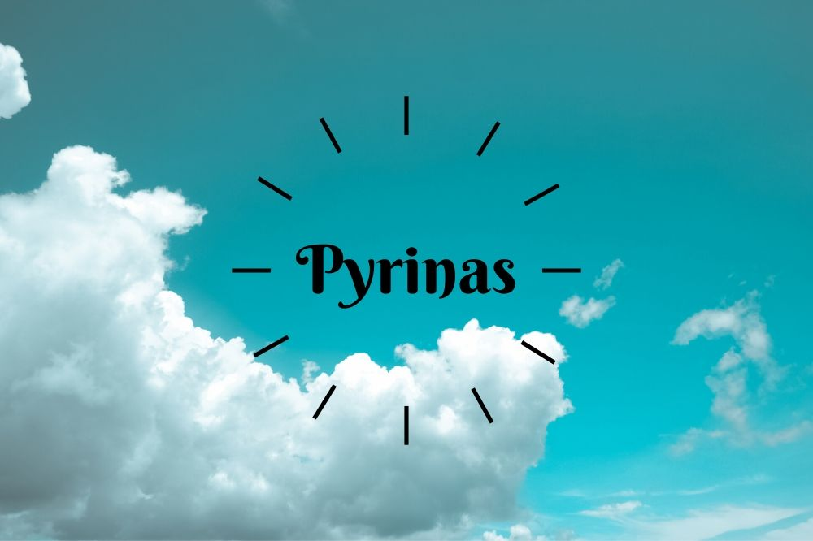

# Pyrinas: for Particle Xenon using nRF SDK v16



This repository is a scaffold that anyone can use to get started with the nRF52 DK.
Currently the only board definition available is for the Particle Xenon.

## Install (Mac OSX Only)

**Note:** want to add your platform? Pull requests are appreciated! :)

1. Clone this repository into a folder on your machine. `git clone https://github.com/pyrinas-iot/pyrinas-os.git`
1. Change directories to `pyrinas-os`
1. Run `make setup`. This will download and extract a copy of the toolchain, and SDK.
1. For a first time startup, you'll have to run `make gen_key`. This key is used for secure DFU.

*Note* if `make setup` fails at any point, you can always run `make toolchain_clean` and `make sdk_clean` and then re-run `make setup`

## Other setup

You should update two variables in the main `Makefile`:

`PROG_SERIAL` - change this to the serial of your Jlink programmer.

To get your serial number, run `jlinkexe` and you should see the output:

```
$ jlinkexe
SEGGER J-Link Commander V6.60c (Compiled Dec 23 2019 16:16:43)
DLL version V6.60c, compiled Dec 23 2019 16:16:28

Connecting to J-Link via USB...O.K.
Firmware: J-Link OB-SAM3U128-V2-NordicSemi compiled Jan  7 2019 14:07:15
Hardware version: V1.00
S/N: <YOUR SERIAL HERE>
License(s): RDI, FlashBP, FlashDL, JFlash, GDB
VTref=3.300V


Type "connect" to establish a target connection, '?' for help
```

Look for `S/N:` and you should see your serial!


1. `APP_FILENAME` - should match the name of your app. Make it something memorable!

## Building

`make build` will build your code
`make merge` will merge your code as one hex file. This includes the Softdevice
`make flash_softdevice` will flash the softdevice.
`make flash` will flash your app, bootloader and settings.

**Note:** on a fresh board, you should run `make erase`, `make flash_softdevice` then `make flash`

## Debugging

In order to debug a central and peripheral mode device at the same time you have to define `PROG_SERIAL`
and `PROG_PORT` in your app's Makefile. If you only have one programmer, you will not be able to simultaneously debug.

To get your programmer serial plug in your J-link capable board and run `jlinkexe`:

jlinkexe
    SEGGER J-Link Commander V6.62a (Compiled Jan 31 2020 12:59:22)
    DLL version V6.62a, compiled Jan 31 2020 12:59:05

    Connecting to J-Link via USB...O.K.
    Firmware: J-Link OB-SAM3U128-V2-NordicSemi compiled Jan 21 2020 17:30:48
    Hardware version: V1.00
    S/N: 581758669
    License(s): RDI, FlashBP, FlashDL, JFlash, GDB
    VTref=3.300V


    Type "connect" to establish a target connection, '?' for help
    J-Link>

Find the **S/N** area. This is your serial number!

To simultaneously debug, make sure that `PROG_PORT` is set to different values for each app you have. (Good port numbers
are 19020, 19021, etc)

Then, run these in two separate windows. The window you'll care about is the window that `make rtt` is run in.

```
make debug
make rtt
```

You'll have to do this for each project you want to debug.
## Uninstalling Toolchain or SDK

1. Run `make sdk_clean` for the SDK
1. Run `make toolchain_clean` for the Toolchain

Both options will remove the respective directories.

## Adding a project.

For more information on how to start your own project with Pyrinas,
[check out the template repository.](https://github.com/pyrinas-iot/pyrinas-template)

## What's in the pipeline?

[All future tasks are located here.](https://github.com/pyrinas-iot/pyrinas-os/projects/1)

## Special Thanks

There are a few projects that if they did not exist, so would this project! In no particular order:

* [NanoPB](https://github.com/nanopb/nanopb) is a low level C implementation of Protocol Buffers.
* [LittleFS](https://github.com/ARMmbed/littlefs) is a filesystem implementation used by many embedded systems.
* [Nordic's SDK](https://developer.nordicsemi.com) maybe it's too obvious, but without the great work of Nordic nothing here would exist!